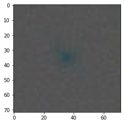
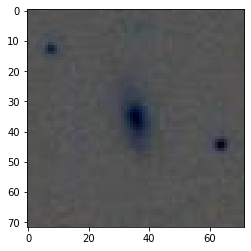
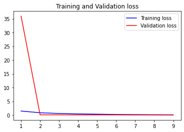
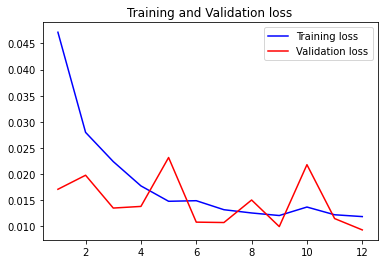

# Photometric-Redshift-Estimation
### Estimating Photometric Redshift using Deep learning
---
### Definition:
* **Redshift** - A redshift reveals how an object in space (star/planet/galaxy) is moving compared to us. It lets astronomers measure a distance for the most distant objects in our universe. Most distant objects are the oldest.
* **Photometric redshift** - The technique uses photometry (that is, the brightness of the object viewed through various standard filters, each of which lets through a relatively broad passband of colours, such as red light, green light, or blue light) to determine the redshift, and hence, through Hubble's law, the distance, of the observed object.

---
### Data:
link - http://www.usm.lmu.de/people/moster/Teaching/ML2018.html

Images from the dataset:
 

 

---
### Models Trained:
1. Custom CNN model- 3 Conv block. Single CONV block contains conv layer, activation layer, batch normalization layer, Dropout layer.
2.  DenseNet - 121(transfer learning)
---
### Results:
Custom CNN - redshift value MSE: 0.45
 

DenseNet 121 - redshift value MSE: 0.01
 

---
### Acknowledgements
- Photometric redshifts from SDSS images using a Convolutional
Neural Network
  - https://arxiv.org/pdf/1806.06607.pdf
---
